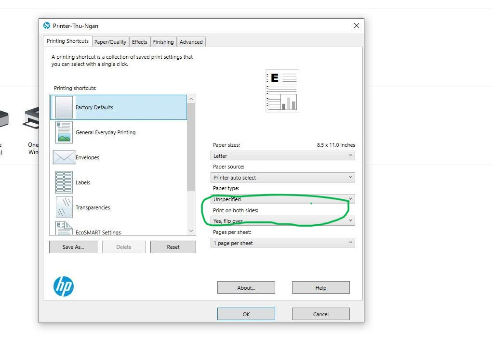
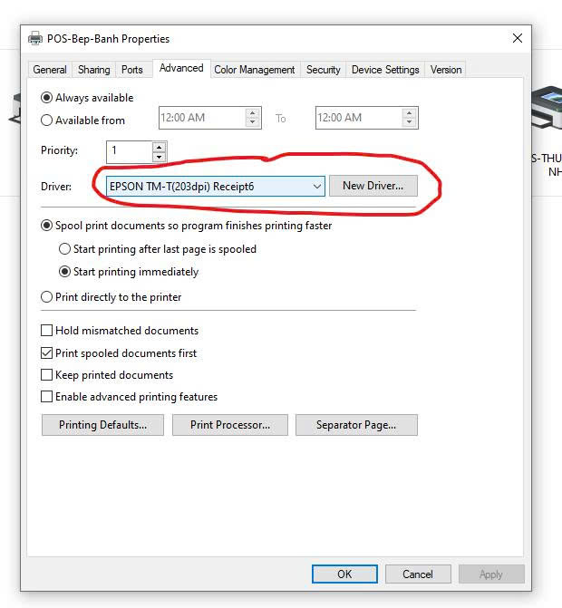

# Cách khắc phục các lỗi máy in

## 1. Máy in không in được 2 mặt mà in ra 2 tờ

### Nguyên nhân 1: Do chưa chọn in 2 mặt. 

    1.  Cài đặt trong Printing preferences.  

    - Print on both sides -> yes, flip over 
    - Ok 

    2. Trên trang cài đặt trang in chọn: `Print on both sides - Flip on long edge`

### Nguyên Nhân 2: Máy in chưa đúng driver.  

- Remove Máy in trong control panel 

- Cài lại Driver máy in cho đúng.  `HP laserjet pro 4003dn driver`
https://ftp.hp.com/pub/softlib/software13/printers/LJ4001-4004/HPEasyStart-16.2.1-LJ4001-4004_UW_54_4_5341_Webpack.exe

- Click chuột phải vào máy in chọn `Printing preferences`  

- Chỗ Print on both sides phải như hình (KHÔNG được có chữ Manual) là OK.  

## 2. Máy in POS EPSON TM-T82III,   TM-T81III  in dài cả mét, mực không đều, không tự cắt 

Tags: [ #POS, #TM-T81III ]

> Nguyên nhân:  máy bị cài sai driver.

### Cài lại driver đúng với máy
* Download và setup:   
`EPSON Advanced Printer Driver 6 for TM- T82III`  
https://download-center.epson.com/softwares/?device_id=TM-T82III&os=WIN1164&language=vi&region=VN

### Chọn lại driver cho đúng với máy pos
* Control Panel -> Device and Printer -> Click chuột phải vào máy in `POS-Bep-Banh` 
* Chọn Print Properties -> Chọn tab Advanced. 
* Driver: Chọn `EPSON TM-T(203dpi) Receipt6`
* Click OK

  
